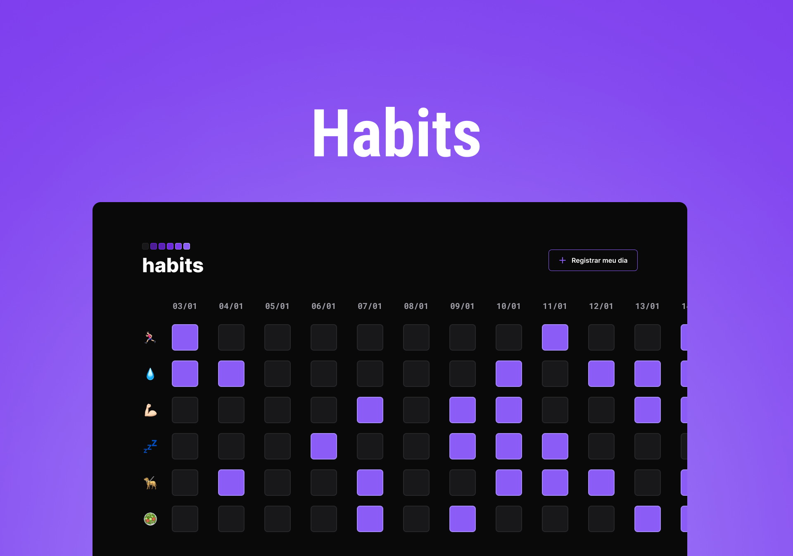

<h1 align="center"> <b>Habits</b> </h1>

Projeto Habits desenvolvido para Rastreamento de Habitos diarios.  

  <a href="#-tecnologias">Tecnologias</a>&nbsp;&nbsp;&nbsp;|&nbsp;&nbsp;&nbsp;
  <a href="#-projeto">Projeto</a>&nbsp;&nbsp;&nbsp;|&nbsp;&nbsp;&nbsp;
  <a href="#-layout">Layout</a>
 

 

  

## 🚀 Tecnologias

Esse projeto foi desenvolvido com as seguintes tecnologias:

- HTML e CSS
- JavaScript
- Git e Github
- Figma

## 💻 Projeto

O Habits é um Rastreador de Habitos diarios.

- [Projeto Finalizado]()

--

Feito com ♥ by Gabriel & Rocketseat